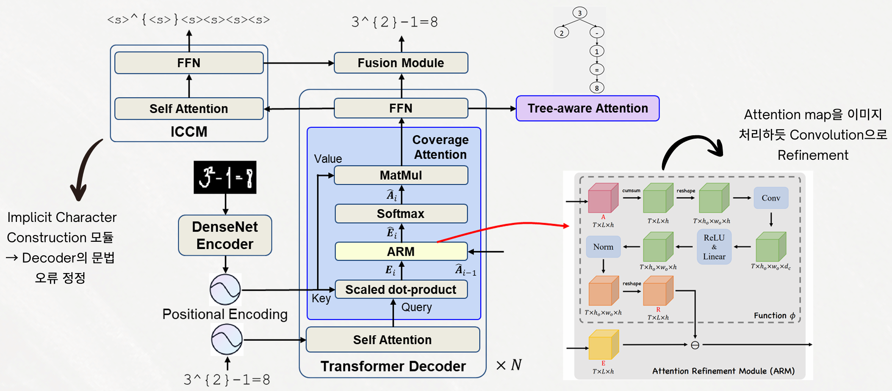

# LazyTeX - YAICON 7th

## Introduction
This project aims to develop an OCR system that converts handwritten mathematical expression images into LaTeX sequences. Existing models have shown limitations in terms of accuracy and inference time due to their insufficient reflection of the structural characteristics of mathematical expressions (e.g., parenthesis matching, tree structure). The main architecture of this model is built upon a Tree-Aware Transformer (TAMER).

The proposed model aims to enhance mathematical expression recognition performance by directly utilizing the structural tree information of the expressions during Decoder training and correcting grammatical errors by refining the attention map based on convolution.

```bash
# Each directory is trained and run independently, and their configuration and execution methods are also separated.
tamer_fusion/ # TAMER + Fusion module
tamerical/    # TAMERICAL variation
```

## Model Architecture


---

## Repository Structure

```bash
lazytex/
├── README.md             # Integrated project outline
│
├── tamer_fusion/        
│   ├── config/
│   ├── eval/
│   ├── tamer/
│   ├── train.py
│   ├── setup.py
│   ├── requirements.txt
│   └── README.md
│
└── tamerical/           
    ├── TAMER/
    ├── datamodule/
    ├── model/
    ├── predict.py
    ├── requirements.txt
    ├── image.png
    └── lightning_logs/
```

## Dataset Preparation
You need to download the CROHME dataset in [download link](https://disk.pku.edu.cn/link/AAF10CCC4D539543F68847A9010C607139). After downloading, please extract it to the `data/` folder in each of {tamer_fusion, tamerical} folder.

## Reference
- [CoMER](https://github.com/Green-Wood/CoMER) | [arXiv](https://arxiv.org/abs/2207.04410)
- [ICAL](https://github.com/qingzhenduyu/ICAL) | [arXiv](https://arxiv.org/abs/2405.09032)
- [BTTR](https://github.com/Green-Wood/BTTR) | [arXiv](https://arxiv.org/abs/2105.02412)
- [TreeDecoder](https://github.com/JianshuZhang/TreeDecoder)
- [CAN](https://github.com/LBH1024/CAN) | [arXiv](https://arxiv.org/abs/2207.11463)
- [TAMER](https://github.com/qingzhenduyu/TAMER) | [arXiv](https://arxiv.org/abs/2408.08578)
